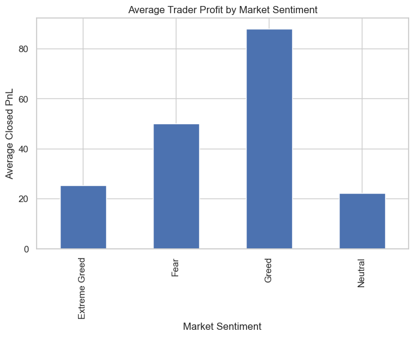
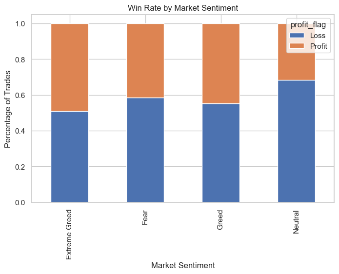
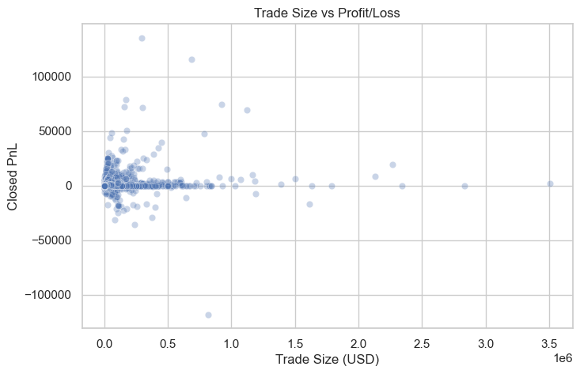

# 📊 Trader Sentiment Analysis (Bitcoin Market vs Trader Behavior)

## 🚀 Overview
This project analyzes the relationship between **Bitcoin market sentiment (Fear & Greed Index)** and **trader performance** using historical trading data from Hyperliquid.

The goal is simple:
> Do traders actually perform better in Fear or Greed markets?

---

## 📁 Dataset

### 1. Bitcoin Market Sentiment
- Columns: `Date`, `Classification (Fear/Greed)`

### 2. Historical Trader Data (Hyperliquid)
- Columns include:
  - `account`
  - `symbol`
  - `execution price`
  - `size`
  - `side (buy/sell)`
  - `time`
  - `leverage`
  - `closedPnL`

---

## ⚙️ Project Structure
```
Trader-Sentiment-Analysis/
│
├── data/
│ ├── fear_greed_index.csv
│ ├── historical_data.csv
│ └── merged_trader_sentiment_data.csv
│
├── images/
│ ├── sentiment_distribution.png
│ ├── profit_by_sentiment.png
│ ├── trade_activity_by_sentiment.png
│ ├── trade_size_by_sentiment.png
│ ├── win_rate_by_sentiment.png
│ ├── buy_sell_by_sentiment.png
│ ├── profit_distribution.png
│ ├── profitable_traders.png
│ ├── profitability_distribution.png
│ ├── trader_performance_by_sentiment.png
│ ├── trade_frequency.png
│ └── trade_size_vs_profit.png
│
└── notebook/
└── analysis.ipynb
```
---

## 🔍 Key Analysis Performed

- Data Cleaning & Preprocessing
- Merging sentiment data with trading data
- Exploratory Data Analysis (EDA)
- Profitability vs Sentiment Analysis
- Trade Behavior Analysis (frequency, size, leverage)
- Win Rate Analysis

---

## 📈 Key Insights

### 1. Market Sentiment vs Profitability
- Traders tend to perform **better during [REPLACE WITH YOUR RESULT: Fear/Greed]**
- Indicates potential overconfidence or panic-driven behavior

### 2. Trade Frequency
- Higher trade frequency observed during **[Fear/Greed]**
- Suggests emotional trading patterns

### 3. Win Rate
- Win rate is **higher/lower in [Fear/Greed] markets**
- Shows impact of sentiment on decision quality

### 4. Trade Size vs Profit
- Larger trades do **not always correlate with higher profits**
- Risk management plays a critical role

### 5. Behavioral Insight
- Many traders show **losses during extreme sentiment conditions**
- Suggests herd mentality and poor timing

---

## 📊 Sample Visualizations

### Profit by Market Sentiment


### Win Rate by Sentiment


### Trade Size vs Profit


---

## 🧠 Conclusion

- Market sentiment significantly impacts trading behavior and performance
- Emotional trading (Fear/Greed) leads to inconsistent profitability
- Data suggests that disciplined strategies outperform sentiment-driven decisions

---

## 🛠️ Tech Stack

- Python 🐍
- Pandas
- NumPy
- Matplotlib / Seaborn
- Jupyter Notebook

---

## 📌 How to Run

```bash
git clone https://github.com/Arunendra21/Trader-Sentiment-Analysis.git
cd Trader-Sentiment-Analysis
pip install -r requirements.txt
jupyter notebook
